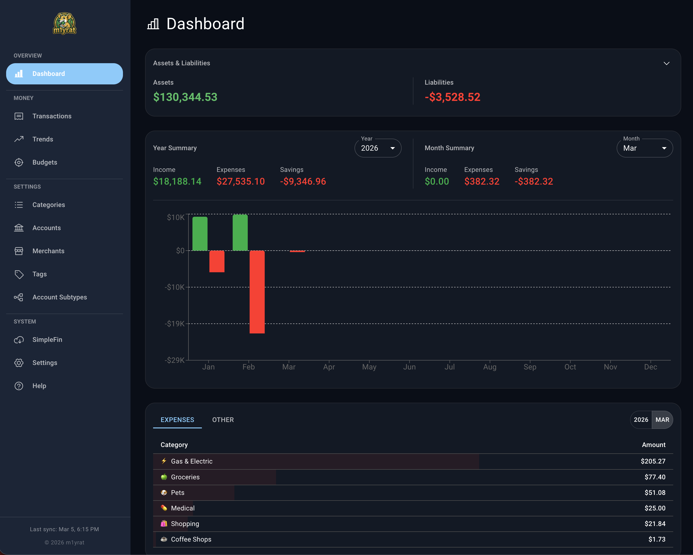
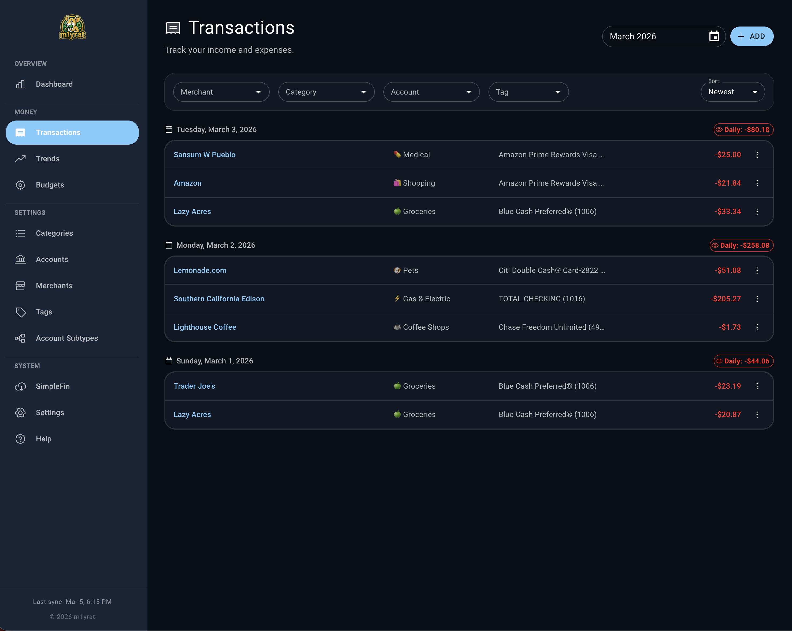
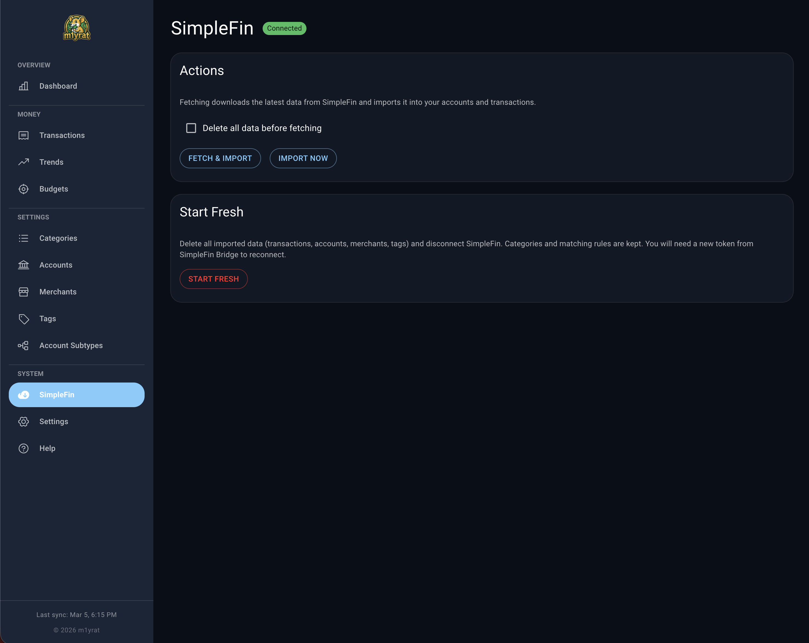

<p align="center">
  
</p>

<h1 align="center">m1yrat</h1>

<p align="center">
  A personal finance tracker for recording expenses and tracking spending over time.
</p>

---

## Screenshots

| Dashboard | Transactions |
|:---------:|:------------:|
|  |  |

| SimpleFin Bank Sync (Pro) |
|:-------------------------:|
|  |

## Features

- Record and categorize transactions (expenses, income, transfers)
- Create and manage accounts, merchants, and categories
- Tag transactions for flexible grouping
- Filter and search transactions by date, account, category, merchant, or tag
- View spending summaries and trends over time
- Upload custom icons for accounts and merchants
- Import transactions from CSV files
- Mobile-friendly responsive design
- Self-hosted with Docker — your data stays on your machine

## Quick Start

### Requirements

- [Docker](https://docs.docker.com/get-docker/) and [Docker Compose](https://docs.docker.com/compose/install/)

### Deploy in 3 steps

1. **Clone this repo**

   ```bash
   git clone https://github.com/webdevised/m1yrat.git
   cd m1yrat
   ```

2. **Start the app**

   ```bash
   docker compose up -d
   ```

3. **Open your browser**

   Go to [http://localhost:8080](http://localhost:8080)

That's it. The database is created automatically on first run.

## Configuration

Copy `.env.example` to `.env` to customize settings:

```bash
cp .env.example .env
```

| Variable    | Default | Description                          |
|-------------|---------|--------------------------------------|
| `HOST_PORT` | `8080`  | Port to expose m1yrat on your host   |

## Updating

Pull the latest image and restart:

```bash
docker compose pull
docker compose up -d
```

Your data is preserved across updates.

## Data & Backups

All data is stored in a PostgreSQL database inside a Docker volume (`postgres-data`).

**Create a backup:**

```bash
docker compose exec postgres pg_dump -U m1yrat m1yrat > backup_$(date +%Y%m%d).sql
```

**Restore a backup:**

```bash
docker compose exec -T postgres psql -U m1yrat m1yrat < backup_20250101.sql
```

## Pro Edition

The **Pro Edition** adds automatic bank sync and hands-on support for getting the most out of m1yrat.

**Automatic bank sync** — Connect to thousands of banks and financial institutions via [SimpleFin](https://www.simplefin.org/) to automatically import your transactions. SimpleFin requires a separate account with a **$15/year** subscription that you create and own independently.

**Also included:**

- Step-by-step guide for hosting m1yrat on a NAS (Synology, QNAP, etc.)
- Instructions for accessing your instance from anywhere with Tailscale
- Email support
- Priority feature requests
- Early access to new features

**One-time purchase: $29** — [m1yrat.com](https://m1yrat.com)

## License

m1yrat is proprietary software. This repository contains deployment files only — no source code is included. The Docker image is provided free of charge for personal use. Redistribution or modification of the Docker image is not permitted.
